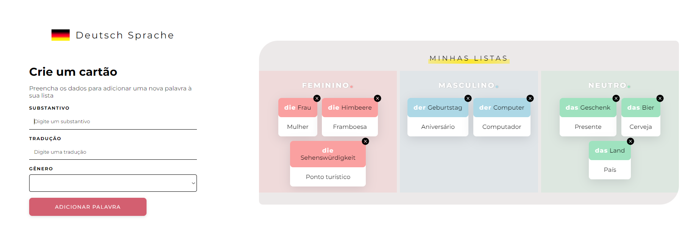

  <h1>Deutsch Sprache</h1>
  
Projeto de apredizado realizado com base dos conhecimentos adquiridos nos cursos de "React: desenvolvendo com JavaScript" e "React: como os componentes funcionam" da Alura.

  </img>

  <h2>URL:</h2> https://alemao-react-carolgmilano.vercel.app

  <h3>Resumo:</h3>
Sou estudante de alemão e percebo que vários estudantes têm dificuldades em memorizar os substantivos com seus respectivos artigos.
Os substantivos da língua alemã podem ter três gêneros: feminino, masculino ou neutro. Portanto, pode ser um pouco confusa a assimilação das palavras por não termos três gêneros na língua portuguesa e por saber que, nem sempre, o gênero de uma palavra em português terá o mesmo gênero em alemão - como é o caso de "A menina/das Mädchen" que em português é feminino e em alemão é neutro.

Com base nisso, decidi criar uma pequena aplicação para cadastro de substantivos em alemão, com código de cores - o que ajuda muito na memorização das palavras.

